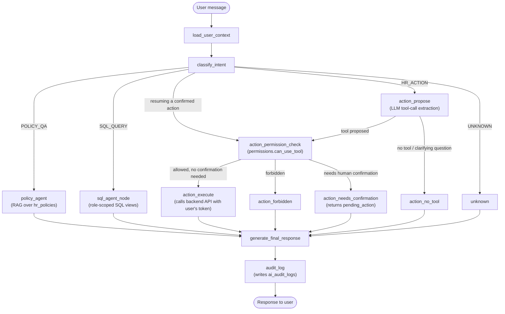

# CB Nest

**CB Nest** is a full-stack HR Management System built for hands-on learning. It covers real-world business workflows — employee lifecycle, attendance, leave approvals, payroll, ticketing, and more — using a modern stack (FastAPI + Next.js + Docker). Use it to understand how production-grade HRMS platforms work, and extend it with your own AI features.

> 📖 **New here?** Start with the [Learner Guide](docs/Learner_Guide.md) for a complete walkthrough of the project architecture, database, and how to explore the code.

## Overview

This project provides a working HRMS platform with authentication, employee operations, attendance, leave management, communication features, finance data views, and ticketing workflows.

It is designed as a practical base for AI feature integration (RAG, assistants, agent workflows) without rebuilding core HR modules from scratch.


## Tech Stack

- Frontend: Next.js 15, React 19, Tailwind CSS
- Backend: FastAPI, SQLAlchemy (async), Pydantic v2
- Database: SQLite
- Migrations: Alembic
- Orchestration: Docker Compose

## Features

- JWT auth with role-aware access (ADMIN, MANAGER, EMPLOYEE)
- Employee directory with search, filters, and pagination
- Attendance clock in/clock out with status and mode tracking
- Leave balances and leave request workflow
- Announcements and polls
- Team calendar (leaves, WFH, holidays, birthdays)
- My Profile edits, profile photo upload, job history, documents
- Finance views (salary, statutory, payroll history)
- Tickets with assignment, status updates, onboarding tasks
- HR policy upload/download library
- Admin/Manager employee document upload flow (APPOINTMENT, TAX, PAYSLIP, OTHER)
- My Documents with search, view, and download; delete is allowed only for `OTHER` document type
- Password-protected PDF payslips (DOB in `DD-MM-YY`) for generated and uploaded payslips
- Notification bell for announcements, polls, ticket assignment, ticket status, leave decision, and employee-document uploads by others (not self-uploads)
- **AI PeopleOps Copilot** (Phase 4) — Policy RAG assistant, read-only NL-to-SQL data agent, HR task automation agent with backend API tool-calling, role-based AI permissions, and AI audit logging. See [AI Copilot](#ai-copilot-phase-4) below.

## Repository Structure

```text
.
|-- backend/
|   |-- alembic/
|   |   |-- versions/
|   |   `-- env.py
|   |-- app/
|   |   |-- api/v1/endpoints/
|   |   |-- core/
|   |   |-- db/
|   |   |-- models/
|   |   |-- schemas/
|   |   `-- services/
|   |-- scripts/
|   |   `-- seed.py
|   |-- storage/
|   |   |-- hr-policies/
|   |   `-- profile-photos/
|   |-- .env.example
|   |-- alembic.ini
|   |-- Dockerfile
|   `-- requirements.txt
|-- frontend/
|   |-- app/
|   |   |-- announcements/
|   |   |-- attendance/
|   |   |-- dashboard/
|   |   |-- employees/
|   |   |-- finance/
|   |   |-- hr-policies/
|   |   |-- leaves/
|   |   |-- login/
|   |   |-- me/
|   |   |-- organization/
|   |   |-- polls/
|   |   |-- team-calendar/
|   |   `-- tickets/
|   |-- components/
|   |   |-- layout/
|   |   `-- ui/
|   |-- lib/
|   |   `-- api.ts
|   |-- Dockerfile
|   |-- middleware.ts
|   `-- package.json
|-- docs/
|   |-- api/
|   |-- Learner_Guide.md
|   |-- PRD.md
|   `-- db_tables_samples.md
|-- docker-compose.yml
`-- README.md
```

## Prerequisites

- **Docker Desktop** (or Docker Engine + Compose v2)
  - On Windows: install [Docker Desktop](https://www.docker.com/products/docker-desktop/) and ensure the **WSL 2 backend** is enabled
- **Git**


## Quick Start

First-time setup:

```bash
git clone <repo-url>
cd HRMS
cp backend/.env.example backend/.env
```


For PowerShell on Windows:

```powershell
Copy-Item backend/.env.example backend/.env
```

Then run from repository root:

```bash
docker-compose up -d --build
docker-compose exec api alembic -c alembic.ini upgrade head
docker-compose exec api python scripts/seed.py
```

Open:

- App: `http://localhost:3000`
- API docs: `http://localhost:8000/docs`
- API redoc: `http://localhost:8000/redoc`

Verify everything is working:

```bash
docker-compose ps
```

## Default Credentials

- Admin: `admin@mock-hrms.dev` / `password123`
- Manager: `manager@mock-hrms.dev` / `password123`
- Employee: `employee@mock-hrms.dev` / `password123`

## Configuration

Backend environment file: `backend/.env`

Use `backend/.env.example` as reference. Current key settings:

- `DATABASE_URL=sqlite+aiosqlite:///./storage/hrms.db`
- `APP_TIMEZONE=Asia/Kolkata`
- JWT settings (`JWT_SECRET_KEY`, expiry values)

## Common Commands

Start services:

```bash
docker-compose up -d
```

Restart API + Web after code changes:

```bash
docker compose restart api web
```

Stop services:

```bash
docker-compose down
```

Run migrations:

```bash
docker-compose exec api alembic -c alembic.ini upgrade head
```

Reseed data:

```bash
docker-compose exec api python scripts/seed.py
```

Optional one-time migration (legacy payslip files to DOB-password-protected PDFs):

```bash
docker compose exec api python scripts/migrate_payslips_to_encrypted_pdf.py
```

Check containers:

```bash
docker-compose ps
```

## Reset Database

On macOS/Linux:

```bash
docker-compose down
rm -f backend/storage/hrms.db
docker-compose up -d --build
docker-compose exec api alembic -c alembic.ini upgrade head
docker-compose exec api python scripts/seed.py
```

On PowerShell:

```powershell
docker-compose down
Remove-Item backend\storage\hrms.db -Force -ErrorAction SilentlyContinue
docker-compose up -d --build
docker-compose exec api alembic -c alembic.ini upgrade head
docker-compose exec api python scripts/seed.py
```

## API Notes

- API base path: `/api/v1`
- Health checks:
  - `/health`
  - `/api/v1/health`
- Standard response envelope:
  - Success: `{ "success": true, "data": ..., "error": null }`
  - Error: `{ "success": false, "data": null, "error": { "code": "...", "message": "..." } }`
- Document uploads:
  - Employee self-upload: `POST /api/v1/employees/me/documents`
  - Employee self-delete: `DELETE /api/v1/employees/me/documents/{document_id}` (`OTHER` type only)
  - Admin/Manager upload for any employee: `POST /api/v1/employees/{employee_id}/documents`
  - Admin/Manager payslip upload: `POST /api/v1/employees/{employee_id}/documents/payslip`

## AI Copilot (Phase 4)

The AI layer lives under `backend/app/services/ai/` and is wired into the
existing app rather than bolted on as a separate service. See
[`docs/ai_architecture.md`](docs/ai_architecture.md) for the full design.

### What it does

- **Policy RAG** (`POST /api/v1/chat/policy`) — chunks + embeds `hr_policies`
  content/files with a local `sentence-transformers` model, stores vectors in
  a persistent local ChromaDB, retrieves relevant chunks, and generates a
  grounded answer (Gemini by default, Claude also supported) with source
  citations. Falls back to returning the best-matching excerpt verbatim if
  no LLM key is configured, so retrieval is demonstrable even before you add
  a key.
- **SQL Agent** (`POST /api/v1/chat/sql`) — natural language to a single
  read-only `SELECT`, executed against per-request, per-role SQLite `TEMP
  VIEW`s (never the raw tables), so row/column-level security is enforced by
  the database itself, not just by the prompt.
- **HR Action Agent** (`POST /api/v1/chat/actions`) — LLM tool-calling
  picks a backend API to call with the *current user's own token*; the AI
  layer never writes to the database directly. High-impact actions
  (approve/reject leave, assign ticket/project, post announcement) return a
  confirmation step before executing.
- **Router** (`POST /api/v1/chat/router`, optional) — classifies a message
  into `POLICY_QA` / `SQL_QUERY` / `HR_ACTION` / `UNKNOWN` so a single chat
  box can dispatch to the right agent.
- **LangGraph orchestration** — `/chat/policy`, `/chat/sql`, and
  `/chat/actions` all run through one compiled `langgraph.graph.StateGraph`
  (`backend/app/services/ai/graph.py`): load user context → classify intent
  → route to the right agent → (for actions) propose → permission-check →
  confirm-gate → execute → generate final response → audit log. See
  `docs/ai_architecture.md` for the node/edge diagram.
- **AI audit log** (`ai_audit_logs` table) — every call above is recorded
  with user, role, message, intent, tool used, and outcome.
- Frontend: `/ai-copilot` page (chat with mode tabs, source chips, SQL result
  table, action confirmation cards).

### Workflow

`/chat/policy`, `/chat/sql`, and `/chat/actions` all run through one
compiled LangGraph `StateGraph` (`backend/app/services/ai/graph.py`) rather
than each endpoint calling its agent directly:



Notes:

- Each endpoint sets `forced_intent` so `classify_intent` skips the router
  LLM call when it already knows the route; only the standalone
  `/chat/router` endpoint (used by the frontend's "Auto" mode) actually
  invokes the classifier.
- Conversation history (last 10 messages) is threaded into both
  `classify_intent` and `action_propose`, so a follow-up like *"its a casual
  leave"* answering an earlier clarifying question is understood in context
  instead of being classified as a brand-new, unrelated message.
- `action_permission_check` calls the exact same `permissions.can_use_tool`
  that `action_execute` also checks internally before running a tool — one
  source of truth, checked twice (early exit + defense in depth), never two
  different policies.

### Setup

1. Install the extra Python deps (already in `requirements.txt`):
   `google-genai`, `anthropic`, `sentence-transformers`, `chromadb`, `sqlglot`, `httpx`, `langgraph`.
   `sentence-transformers` pulls in `torch`; on an Intel Mac make sure you're
   on Python 3.11/3.12 (torch's last macOS x86_64 wheel is 2.2.2 — there is no
   Python 3.13 x86_64 wheel).
2. Copy `backend/.env.example` → `backend/.env` and set `GEMINI_API_KEY`
   (get one at [aistudio.google.com](https://aistudio.google.com/apikey)) to
   enable generation (RAG answers, SQL generation, action tool-calling, and
   LLM-based intent routing). To use Claude instead, set
   `AI_LLM_PROVIDER=anthropic` and `ANTHROPIC_API_KEY`. Without a key,
   retrieval/guardrails still run and the endpoints return a clear "AI
   generation is not configured" message instead of erroring.
3. Run the app once — the vector store is built automatically on startup if
   empty. To rebuild it manually after editing policy content:
   `python -m scripts.ingest_policies` (run inside the backend venv/container).

### Environment variables (`backend/.env`)

| Variable | Purpose |
|---|---|
| `AI_LLM_PROVIDER` | `gemini` (default) or `anthropic` |
| `GEMINI_API_KEY` | Gemini API key; used when `AI_LLM_PROVIDER=gemini` |
| `ANTHROPIC_API_KEY` | Claude API key; used when `AI_LLM_PROVIDER=anthropic` |
| `AI_MODEL_NAME` | model id for the selected provider (default `gemini-flash-latest`) |
| `AI_EMBEDDING_MODEL_NAME` | local sentence-transformers model (default `all-MiniLM-L6-v2`) |
| `AI_VECTOR_STORE_DIR` | on-disk ChromaDB persistence directory |
| `AI_SQL_MAX_ROWS` | hard cap on rows the SQL agent can return |
| `INTERNAL_API_BASE_URL` | base URL the Action Agent's tools call back into (this same service) |

## Troubleshooting

- If frontend shows stale build/runtime issues:
  - `docker-compose restart web`
- If API changes are not reflected:
  - `docker-compose restart api`
- If migration or seed fails:
  - reset DB using the commands above, then migrate and seed again

## Documentation

- Learner guide: [`Learner_Guide.md`](docs/Learner_Guide.md) — full project walkthrough, architecture, database schema, learning path
- Product requirements: [`PRD.md`](docs/PRD.md)
- Database schema reference: [`db_tables_samples.md`](docs/db_tables_samples.md)
- AI chat endpoint contracts: `docs/api/`
- AI architecture (Phase 4): [`ai_architecture.md`](docs/ai_architecture.md)
- AI permissions matrix: [`ai_permissions_matrix.md`](docs/ai_permissions_matrix.md)
- AI evaluation results: [`ai_eval_results.md`](docs/ai_eval_results.md)


Copyright (c) Codebasics. All rights reserved.


